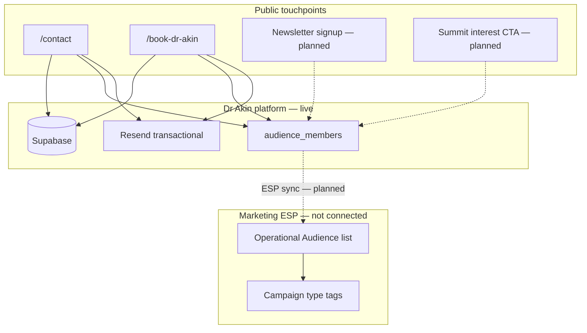
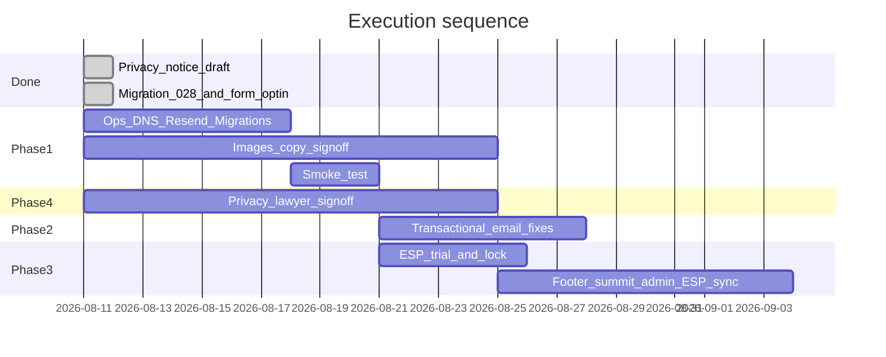

# Launch, Email, and Privacy Plan

**Last updated:** 11 August 2026  
**Status:** In progress — privacy notice published (pending legal sign-off); marketing opt-in live on contact and booking forms; migration 028 applied in production

---

## Implementation status (summary)

| Area | Status | Notes |
| ---- | ------ | ----- |
| Privacy notice (NDPA/GDPR draft) | **Done** | Live at `/privacy` — commit `cae9e81` |
| Lawyer review callouts | **Pending** | Address, NDPC registration, DPAs |
| Migration 028 (`audience_members`) | **Done** | Applied successfully in Supabase |
| Marketing opt-in — contact form | **Done** | Commit `988eeec` |
| Marketing opt-in — booking form | **Done** | Commit `988eeec` |
| `subscribe_audience_member` RPC | **Done** | Non-blocking after form submit |
| Footer newsletter signup | **Not started** | Phase 3 |
| Summit interest form | **Not started** | Phase 3 |
| Admin `/admin/audience` view | **Not started** | Phase 3 |
| ESP sync (Beehiiv / Kit) | **Not started** | Phase 3 — tool not locked |
| Resend production setup | **Pending** | Domain verification + Vercel env vars |
| Phase 2 transactional email fixes | **Not started** | Conversion notify, status emails, preview |
| Tier-1 images and assets | **Pending** | Client / creative |
| DNS + custom domain cutover | **Pending** | Ops |
| Production smoke test | **Pending** | EA + dev |

### Shipped files

| File | Purpose |
| ---- | ------- |
| [`src/pages/privacy.astro`](../../src/pages/privacy.astro) | Expanded privacy notice |
| [`supabase/migrations/028_audience_members.sql`](../../supabase/migrations/028_audience_members.sql) | Audience table + subscribe RPC |
| [`src/components/marketing/marketing-opt-in-field.tsx`](../../src/components/marketing/marketing-opt-in-field.tsx) | Shared optional marketing checkbox |
| [`src/lib/marketing/subscribe-audience.ts`](../../src/lib/marketing/subscribe-audience.ts) | Client subscribe helper (non-blocking) |
| [`src/components/contact/contact-form.tsx`](../../src/components/contact/contact-form.tsx) | Operational + marketing checkboxes |
| [`src/components/booking/booking-form.tsx`](../../src/components/booking/booking-form.tsx) | Terms + marketing checkboxes |

---

## Architecture overview

**Two systems, one brand:**

- **Resend** ([`api/lib/notifications.ts`](../../api/lib/notifications.ts) + [`api/lib/email-layout.ts`](../../api/lib/email-layout.ts)) — transactional: contact/booking alerts, confirmations; status-update emails still planned
- **Marketing ESP (Beehiiv or Kit)** — newsletters, summit/event announcements, insights digests, partner updates; not connected yet

---

## Phase 1 — Launch essentials

**Goal:** Go live with credible visuals, working forms, and production email delivery.

### 1.1 Infrastructure and ops

| Task | Owner | Status |
| ---- | ----- | ------ |
| DNS cutover for `theakinakinpelu.org` | Domain partner + dev | Pending |
| Set `PUBLIC_SITE_URL` to production domain | Dev | Pending |
| Update Supabase Auth Site URL + redirect URLs | Dev | Pending |
| Apply migrations **018–027** in production | Dev | Confirm with team |
| Apply migration **028** (`audience_members`) | Dev | **Done** |
| Verify Resend domain for `theakinakinpelu.org` | Dev + client | Pending |
| Set Vercel env: `RESEND_API_KEY`, `NOTIFICATION_FROM_EMAIL`, `ADMIN_NOTIFICATION_EMAIL` | Dev | Pending |
| Configure Resend SMTP in Supabase dashboard | Dev | Pending |
| Run [`docs/production-smoke-checklist.md`](../production-smoke-checklist.md) | EA + dev | Pending |

### 1.2 Images and assets

Priority order from [`docs/photography-shoot-brief-google-docs.txt`](../photography-shoot-brief-google-docs.txt):

1. Homepage hero portrait — `dr-akin-portrait.webp`
2. Speaking page (3–5 stage shots)
3. OG/social crop (1200×630)
4. Seven Star Student / Teacher real covers (SVG placeholders today)
5. Publisher book cover art for library
6. Brand PNGs — `/brand/akin-logo-mono.png` (used in email templates)
7. Work org hero visuals — post-launch acceptable if needed

**Acceptance:** No broken logo or placeholder book covers on public pages at launch.

### 1.3 Legal and copy sign-off

- [ ] Continental copy deck — [`continental-copy-deck.md`](continental-copy-deck.md)
- [ ] Approved social URLs → [`src/data/site-contact.ts`](../../src/data/site-contact.ts)
- [x] Privacy notice published at `/privacy` (draft — lawyer review still required)
- [ ] Remove lawyer review callouts from privacy page after counsel sign-off

---

## Phase 2 — Transactional email hardening

**Goal:** Close gaps in existing Resend implementation; no admin email CMS.

| Task | File(s) | Priority | Status |
| ---- | ------- | -------- | ------ |
| Fix enquiry → booking conversion notification | [`src/lib/booking/api.ts`](../../src/lib/booking/api.ts) | High | Not started |
| Organizer status-update emails | [`api/lib/notifications.ts`](../../api/lib/notifications.ts) | Medium | Not started |
| Read-only email preview in admin | New admin route or modal | Medium | Not started |
| Document Resend vars in `.env.example` | `.env.example` | Low | Not started |
| Submitter confirmation failure logging | [`api/notify-submission.ts`](../../api/notify-submission.ts) | Low | Not started |

**Defer:** Full admin email template editor, newsletter composer in admin.

---

## Phase 3 — Marketing email

### ESP selection (decision pending)

| Tool | Free tier | Paid entry | Non-technical UX | Recommendation |
| ---- | --------- | ---------- | ---------------- | -------------- |
| **Beehiiv** | 2,500 subs, unlimited sends | ~$49/mo Scale | Excellent | **Primary** |
| **Kit** (ConvertKit) | 10,000 subs, unlimited sends | ~$39/mo Creator | Very good | If list exceeds 2,500 before budget |
| **MailerLite** | 250 subs, 2,500 sends/mo | $12/mo Comfort | Good | Cheapest paid upgrade only |
| **Brevo** | 100K contacts, 300 emails/day | ~$9/mo Starter | CRM-heavy | Not recommended — daily cap hurts “send to all” |
| **Resend Broadcasts** | No meaningful free marketing tier | Bundled | Developer-oriented | Keep Resend transactional only |

**Resend stays separate** for operational transactional mail.

### Unified operational audience model

One **master audience** — everyone who opted in, regardless of touchpoint. **Campaign type** describes *what* you send (newsletter, summit announcement, event, insights digest, partner update), not *who* receives it (default: whole list).

#### Consent model — implemented

| Touchpoint | Operational | Marketing opt-in | Status |
| ---------- | ----------- | ---------------- | ------ |
| Contact form | Required privacy checkbox | Optional `MarketingOptInField` | **Done** |
| Booking form | Required terms checkbox | Optional `MarketingOptInField` | **Done** |
| Footer / Insights | — | Dedicated newsletter signup | Planned |
| PerformX Summit | — | Register interest form | Planned |

Checkbox copy (live):

> I would like to receive updates on insights, events, summit announcements, and partner news. See our privacy notice for how we use this information.

Opt-ins write to `audience_members` via `subscribe_audience_member` with `consent_source`: `contact` or `booking`. Subscribe failures do not block form submission.

#### Campaign type taxonomy (for ESP tags)

| Type | Example use |
| ---- | ----------- |
| `newsletter` | General periodic update |
| `summit_announcement` | PerformX Summit 2026 |
| `event_announcement` | Other events |
| `insights_digest` | New articles roundup |
| `partner_update` | AALD / PerformX partnership news |

#### Data model — implemented (migration 028)

Table: `audience_members` — fields include `email`, `name`, `consent_at`, `consent_source`, `engagement_context`, `esp_provider`, `esp_subscriber_id`, `status`, `unsubscribed_at`.

RPC: `subscribe_audience_member(p_email, p_name, p_consent_source, p_engagement_context)` — dedupes by email; reactivates previously unsubscribed rows.

#### Phase 3 remaining build

| Component | Status |
| --------- | ------ |
| Migration 028 | **Done** |
| Contact + booking marketing checkboxes | **Done** |
| Footer newsletter signup | Not started |
| Summit interest form on `/events/performx-summit-2026` | Not started |
| ESP sync (Beehiiv API / Kit API on subscribe) | Not started |
| Admin `/admin/audience` (count, source breakdown, CSV export) | Not started |

**Do not backfill** historical `enquiries` or `booking_requests` without re-consent.

---

## Phase 4 — Privacy notice

### Published (11 August 2026)

- Live at [`/privacy`](../../src/pages/privacy.astro) — integrated from Gemini legal draft
- Covers operational + marketing processing, NDPA and GDPR framing, processors, retention, rights, minors, supervisory authorities
- Styled callouts remain for **lawyer review**: postal address, NDPC registration, DPAs

### Still required from counsel

1. Confirm registered business / postal address
2. NDPC registration threshold and number (if applicable)
3. Data Processing Agreements with Supabase, Vercel, Resend, Beehiiv/Kit
4. Final retention periods (draft: 12 months enquiries, 6 years bookings, until-unsubscribe marketing)
5. Cookie / analytics disclosure if in scope

### Lawyer brief (reference)

**Subject:** Public website privacy notice for theakinakinpelu.org  
**Data controller:** Dr. Akin Akinpelu  
**Contact:** hello@theakinakinpelu.org | +234 706 589 5185  
**Jurisdictions:** NDPA 2023 (NDPC GAID) + GDPR (EU/UK visitors)

**Processing activities:** contact enquiries, booking requests, marketing opt-in (separate checkbox), admin accounts, organizer resource access, rate-limit hashing.

**Processors:** Supabase, Vercel, Resend, Beehiiv or Kit (when connected).

**Questions for counsel:**

1. Separate marketing consent checkbox sufficient vs. operational acknowledgement?
2. Summit “register interest” — event-only consent or unified list?
3. Lawful basis for syncing consented contacts to US-based ESP?
4. NDPC registration required at current scale?
5. Cookie/analytics in scope?

### AI legal tool prompt

Use with current [`privacy.astro`](../../src/pages/privacy.astro) content attached. Prompt preserved in plan history — regenerate only if counsel requests a full rewrite.

---

## Critical launch checklist

| Item | Status |
| ---- | ------ |
| DNS + custom domain | Pending |
| Migrations through 028 in production | **028 done** — confirm 018–027 |
| Resend domain verification | Pending |
| Production smoke test | Pending |
| Copy deck + social links | Pending |
| Privacy notice lawyer sign-off | Pending (draft live) |
| Brand/logo assets in deploy | Pending |
| Marketing opt-in on forms | **Done** |
| ESP connected for campaigns | Pending |

**Safe to defer post-launch:** Admin calendar, travel workspace, PDF exports, organizer document upload, keynote recordings, full marketing automations, in-admin campaign composer.

---

## Recommended next steps

1. **Verify marketing opt-in** — submit test contact/booking with checkbox checked; confirm row in `audience_members`
2. **Lawyer review** — `/privacy` callouts; remove callouts after approval
3. **Phase 1 ops** — Resend domain, env vars, smoke test, DNS when ready
4. **ESP trial** — Beehiiv Launch free tier; one internal test send
5. **Phase 3 remainder** — footer signup, ESP sync, `/admin/audience`
6. **Phase 2** — conversion notification + organizer status emails

---

## Execution order (updated)

Marketing **campaigns** should go live only after: lawyer sign-off on privacy notice, ESP domain verified, unsubscribe flow tested, and ESP sync from `audience_members` operational.
